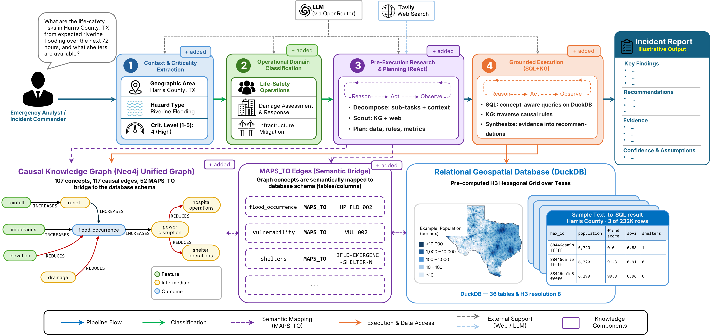

# DisasterLex

Code, data, and per-seed result artifacts for the EMNLP 2026 submission *DisasterLex: Knowledge-Graph-Mediated Agentic Question Answering for Disaster Analytics*.

When an emergency analyst types a question into a database query interface during a developing hurricane or wildfire, the bottleneck is rarely language understanding. The hard part is **schema selection**: choosing which of 36 heterogeneous tables (hazard exposure, social vulnerability, lifeline infrastructure, community resilience...) carry the columns that answer the question, and which causal relations between those tables matter. DisasterLex addresses this by interposing an **Expert Knowledge Graph (EKG)** of 107 curated concepts and 117 typed causal edges between the user's question and a relational backend. A small orchestration pipeline shaped by the operational structure of incident command runs the rest of the system on top of that.



*An analyst's natural-language query flows through four stages: context and criticality extraction, operational-domain classification into an ICS-motivated cluster, a ReAct planner that scouts the EKG and the web, and a ReAct executor that runs concept-aware SQL on DuckDB and traverses EKG causal rules to synthesise an analyst-facing report. The expert-curated Causal Knowledge Graph is bridged to the Relational Database by `MAPS_TO` edges.*

This repository contains everything needed to reproduce the paper's numbers, plus the configuration to re-run the pipeline against new queries.

## What's inside

```
disasterlex-release/
├── src/                          # the agentic pipeline (Python 3.11)
│   ├── agent/                    # 4-stage orchestrator + Text-to-SQL + retrievers
│   ├── graph/                    # ContextGraph (Neo4j wrapper)
│   ├── prompts/                  # 18 routing templates across 3 ICS clusters
│   └── config.py                 # env-driven configuration
├── configs/
│   ├── graph/
│   │   ├── ekg_curated.json      # 107 concept nodes, 117 typed causal edges
│   │   └── ddcg.json             # 36 tables, 150 columns, 7 join rules
│   ├── benchmark/test.json       # 75-case test split (R / K / M / D)
│   └── text_rag/chunks.jsonl     # source corpus for the Text-RAG ablation
├── scripts/
│   ├── run_benchmark.py          # entry point (Full + four internal ablations)
│   ├── load_neo4j.py             # populate Neo4j from EKG + DDCG
│   ├── aggregate_results.py      # reproduce Tables 1 and 2 from per-seed JSONs
│   ├── download_data.sh          # fetch the 4.7 GB DuckDB backend from Zenodo
│   ├── build_ddcg.py / build_lightrag_index.py / build_text_rag_index.py
│   ├── validate_gold_facts.py    # sanity-check benchmark gold against live DB
│   ├── rescore_results.py        # re-score saved runs without re-executing
│   └── baselines/                # runners for the four external baselines
├── results/                      # per-seed result JSONs (see below)
├── assets/
│   └── overview.png              # architecture figure rendered above
├── environment.yml
├── .env.example
└── LICENSE
```

Under `results/`, each of seven base models gets nine condition files times three random seeds — twenty-seven JSONs per model:

- `full_seed{1,2,3}.json`, plus `no-routing`, `no-plan`, `react`, `text-rag` for the **internal ablations** that populate Table 2
- `lightrag-e2e`, `hipporag`, `reforce`, `chess` for the **external baselines** that populate Table 1

`aggregated.json` is the canonical mean ± std summary derived from those per-seed files. One cell is permanently missing — `qwen3-8b/reforce_seed2` exhausted the OpenRouter 1M-token context window on ReFoRCE's self-refinement loop, documented in the Table 1 footnote.

## Getting set up

```bash
# 1. Python + dependencies
conda env create -f environment.yml
conda activate disasterlex

# 2. Neo4j (any 5.x image works)
docker run -d --name disasterlex-neo4j \
  -p 7474:7474 -p 7687:7687 \
  -e NEO4J_AUTH=neo4j/password \
  neo4j:5

# 3. DuckDB backend (~4.7 GB; the Zenodo URL is in the paper)
#    Edit scripts/download_data.sh first to set ZENODO_URL.
bash scripts/download_data.sh

# 4. API keys
cp .env.example .env
#   Add OPENROUTER_API_KEY, and DASHSCOPE_API_KEY if you intend to run Qwen 3.6 Flash.

# 5. Load the EKG + DDCG into Neo4j
python scripts/load_neo4j.py
```

## Reproducing the paper

The fastest path is to skip the pipeline runs entirely. The bundled per-seed JSONs are byte-for-byte the outputs that produced the paper's tables; the aggregator collapses them across seeds.

```bash
python scripts/aggregate_results.py
```

This writes `results/aggregated.json` and prints LaTeX-ready rows for both Table 2 (internal ablations) and Table 1 (external baselines), reproducing every reported cell to three decimals.

If you want to re-run from scratch, each `(model, condition)` cell is a separate call. The full sweep is 105 internal-ablation cells plus 84 external-baseline cells across seven base models — budget roughly an hour per model per condition with `--parallel 3`. A sketch:

```bash
MODELS=(
  google/gemini-3.1-flash-lite-preview
  deepseek/deepseek-v3.2
  qwen3.6-flash
  meta-llama/llama-3.1-8b-instruct
  qwen/qwen3-8b
  qwen/qwen3-32b
  meta-llama/llama-3.3-70b-instruct
)
for MODEL in "${MODELS[@]}"; do
  for COND in full no-routing no-plan react text-rag; do
    for SEED in 1 2 3; do
      python scripts/run_benchmark.py \
        --pipeline-model "$MODEL" --ablation "$COND" --seed "$SEED" \
        --parallel 3 --extractor-model google/gemini-2.5-flash
    done
  done
done
```

Two model-specific quirks are worth flagging:

- **Llama 3.1 8B** refuses Stage 1/2 JSON prompts as safety violations unless `response_format=json_object` is bound at the LLM call site. `src/agent/orchestrator.py` does this automatically based on the model name, so the `--pipeline-model` flag is enough.
- **Qwen3 32B** under the `react` condition needs a longer per-case execute budget. Export `REACT_TIMEOUT=600` before launching.

The external baselines each have their own runner in `scripts/baselines/`. They all consume the same 75-case test split and are scored through the same TRIAGE claim-extraction harness, so their outputs plug straight into `aggregate_results.py`:

```bash
# LightRAG (end-to-end mode)
python scripts/baselines/index_lightrag.py
python scripts/baselines/run_lightrag_baseline.py \
  --pipeline-model google/gemini-3.1-flash-lite-preview --seed 1 \
  --output results/gemini-3.1-flash-lite-preview/lightrag-e2e_seed1.json

# HippoRAG 2
python scripts/baselines/index_hipporag.py
python scripts/baselines/run_hipporag_baseline.py [... --output ...]

# ReFoRCE (needs the SQLite-converted DB)
python scripts/baselines/duckdb_to_sqlite.py
python scripts/baselines/run_reforce_baseline.py [... --output ...]

# CHESS: clone https://github.com/ShayanTalaei/CHESS into external/chess/,
#        install its deps, run from the CHESS repo against a BIRD-formatted
#        dump produced by triage_to_bird_format.py, then score the run-dir:
python scripts/baselines/score_chess_results.py \
  --chess-run-dir external/chess/results/dev/<setting>/<dataset>/<timestamp>/ \
  --pipeline-model google/gemini-3.1-flash-lite-preview --seed 1 \
  --output results/gemini-3.1-flash-lite-preview/chess_seed1.json
```

## A short tour of the pipeline

The orchestrator is a four-stage directed graph in LangGraph, one node per stage:

1. **Context extraction** parses the area of interest, hazard type, and a 1–5 criticality level, and runs a data-availability check against a curated table of sentinel-value patterns (e.g. `sovi = -999`) and a forbidden-table list. Anything that fires becomes an explicit disclosure passed downstream.
2. **Cluster routing** assigns the query to one of three operationally-motivated clusters — life-safety operations, damage assessment and response, infrastructure mitigation — drawn from Incident Command System functional sections. Each cluster has its own prompt template.
3. **Causal-informed planning** is a ReAct agent that retrieves causal edges from the EKG and produces a structured analysis plan.
4. **Tool-augmented execution** is a second ReAct agent with a Text-to-SQL tool (concept-aware schema retrieval over the EKG, LLM SQL generation, syntax validation that rejects `DELETE`/`DROP`, DuckDB execution with three-attempt retry) and a knowledge-graph tool (1-hop edge retrieval and multi-hop Cypher traversal up to three hops).

The 52 concept-to-schema bridges in the EKG are what make Stage 4 cheap: for a query like *"How many hospitals in a given county are in flood-exposed zones?"*, synonym matching activates `flood_occurrence` and `hospitals`, and a 1-hop traversal returns 12 columns instead of the 150 you would inject under a naive prompt.

## Benchmark and evaluation

The test split is 75 cases organised into four tiers:

| Tier | n  | What it measures |
| ---- | -- | ---------------- |
| R    | 17 | Correct ICS cluster and query-type selection |
| K    | 19 | EKG causal-token grounding in the answer |
| M    | 26 | SQL joins across 2–4 tables (numeric tolerance bands ±100 hex counts, ±10% on averages) |
| D    | 13 | Transparent disclosure when data is missing, blocked, or sentinel-valued |

Each case yields a 0–5 judge score. Four of those points are deterministic rule-based checks against frozen gold facts; the fifth is an LLM-judged reasoning check on the five statewide Tier K cases, run by Gemini 2.5 Flash — a different model from any pipeline under evaluation, to keep self-evaluation bias bounded. Claim extraction is validated against a 20-case human-annotated sample at 95% precision overall.

## The DuckDB backend

The 4.7 GB DuckDB is built once, offline, from public-domain U.S. federal data: per-hex hazard scores from FEMA NRI, exposure and population from US Census plus ACS, social-vulnerability indices from CDC/ATSDR SVI, community resilience from FEMA NRI CRI, and facility inventories from HIFLD. Everything is resampled to an H3 resolution-8 hexagonal grid (~0.74 km² per cell) and joined on a shared `hex_id` key. The DDCG node graph is auto-introspected from this DuckDB at system startup, so there is no separate hand-curated schema file.

## What the experiments say

Across seven base models spanning closed-source (Gemini, Qwen 3.6) and open-source (DeepSeek V3.2, Llama 3.1 8B, Qwen3 8B/32B, Llama 3.3 70B), the full DisasterLex pipeline scores in the 1.65–3.56 band on the 75-case test split, and beats four state-of-the-art external baselines (LightRAG, HippoRAG 2, ReFoRCE, CHESS) by 1.4–2.75× on every base model. Disabling cluster routing produces the largest single-component drop on Tier M across every model (0.81–2.67); the planning step and the EKG itself are more capability-dependent, with the largest gains landing on the strongest base models. The full statistical-significance picture (50 of 56 overall (model, alternative) gaps and 168 of 224 per-tier gaps significant at p < 0.05) is in §5 of the paper.

## License

Apache 2.0 — see `LICENSE`. The benchmark cases, the EKG, the DDCG, and the per-seed result artifacts are released under the same license.

## Anonymity

This repository is the anonymous mirror for EMNLP 2026 double-blind review. Code, data, result artifacts, citations, and acknowledgements will be re-released under their canonical names and DOIs upon acceptance.
